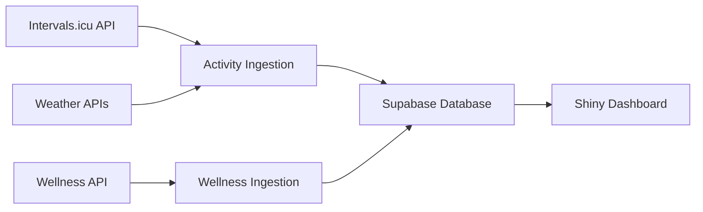

# 🏃 INS Dashboard - Sports Performance Analytics Platform

**A comprehensive data ingestion and visualization system for endurance sports analytics, integrating Intervals.icu data with weather and wellness metrics.**

[](https://python.org)
[](https://supabase.com)
[](https://shiny.posit.co/py/)

---

## 📋 **Overview**

The INS Dashboard provides:
- **🔄 Automated Data Ingestion** from Intervals.icu (activities + wellness)
- **🌤️ Weather Integration** with Open-Meteo API
- **📊 Interactive Dashboard** with interval analysis and performance metrics
- **💪 Robust Architecture** with retry logic and best-effort data capture

### **Key Features**
- ✅ **Hybrid Activity Import** (FIT files + Streams API fallback)
- ✅ **Wellness Data Integration** (HRV, sleep, resting HR)
- ✅ **Weather Enrichment** (temperature, humidity, wind, air quality)
- ✅ **Interval Analysis** with automatic work/rest classification
- ✅ **Real-time Dashboard** with interactive visualizations
- ✅ **Data Integrity Monitoring** with comprehensive validation

---

## 🚀 **Quick Start**

### **Prerequisites**
- Python 3.11+
- Supabase account and project
- Intervals.icu account with API access

### **Installation**

1. **Clone Repository**
   ```bash
   git clone <repository-url>
   cd ins-dashboard
   ```

2. **Install Dependencies**
   ```bash
   pip install -r requirements.txt
   ```

3. **Configure Environment**
   ```bash
   cp .env.example .env
   # Edit .env with your credentials
   ```

4. **Setup Database**
   ```bash
   # Run the schema in your Supabase project
   psql -h <your-host> -f config/database_schema.sql
   ```

5. **Configure Athletes**
   ```bash
   # Create athletes.json with your athlete data
   python scripts/setup_athletes.py
   ```

6. **Test Installation**
   ```bash
   # Run a small data import test
   python src/ingestion/activities.py --athlete-id <id> --start-date 2025-05-01 --end-date 2025-05-07 --dry-run
   ```

---

## 📊 **Usage**

### **Data Ingestion**

#### **Activity Data Import**
```bash
# Import activities for all athletes (last 30 days)
python src/ingestion/activities.py --oldest 2025-04-01 --newest 2025-05-01

# Import specific athlete
python src/ingestion/activities.py --athlete "Matthew Beaudet" --oldest 2025-04-01 --newest 2025-05-01

# Dry run (test without writing to database)
python src/ingestion/activities.py --dry-run --oldest 2025-04-01 --newest 2025-05-01
```

#### **Wellness Data Import**
```bash
# Import wellness data for all athletes
python src/ingestion/wellness.py --start-date 2025-05-01 --end-date 2025-05-31

# Import specific athlete
python src/ingestion/wellness.py --athlete-id i344978 --start-date 2025-05-01 --end-date 2025-05-31
```

### **Dashboard**

#### **Launch Interactive Dashboard**
```bash
python src/dashboard/app.py
# Access at: http://localhost:8000
```

#### **Dashboard Features**
- **📈 Period Summaries** - Training load, distance, time analysis
- **🔍 Activity Analysis** - Detailed activity breakdown with intervals
- **📊 Interval Visualization** - Automatic work/rest classification
- **🌤️ Weather Integration** - Environmental conditions during activities
- **💪 Wellness Tracking** - HRV, sleep, and recovery metrics

---

## 🏗️ **Architecture**

### **Core Components**

#### **Data Ingestion (`src/ingestion/`)**
- **`activities.py`** - Main activity ingestion with FIT + Streams fallback
- **`wellness.py`** - Daily wellness metrics (HRV, sleep, resting HR)
- **`weather_api.py`** - Weather data enrichment with retry logic

#### **Dashboard (`src/dashboard/`)**
- **`app.py`** - Shiny-based interactive dashboard
- **Real-time data visualization** with Plotly integration
- **Responsive design** with mobile-friendly interface

#### **Utilities (`src/utils/`)**
- **`database.py`** - Centralized Supabase connection management
- **`config.py`** - Environment and configuration handling
- **`intervals_api.py`** - Intervals.icu API client with retry logic
- **`moving_time.py`** - Strava-compatible moving time calculations

### **Data Flow**


### **Database Schema**
- **`athlete`** - Athlete profiles
- **`activity_metadata`** - Activity summaries with weather
- **`activity`** - Second-by-second timeseries data
- **`activity_intervals`** - Workout interval segments
- **`wellness`** - Daily wellness metrics

---

## ⚙️ **Configuration**

### **Environment Variables**
```bash
# Supabase Configuration
SUPABASE_URL=your_supabase_project_url
SUPABASE_SERVICE_ROLE_KEY=your_service_role_key

# Weather API (Optional - uses free tier)
OPENMETEO_TIMEOUT=10

# Air Quality API (Optional)
AQ_TIMEOUT=10
```

### **Athlete Configuration (`athletes.json`)**
```json
[
  {
    "id": "i344978",
    "name": "Athlete Name",
    "api_key": "intervals_icu_api_key"
  }
]
```

---

## 🧪 **Testing**

### **Run Test Suite**
```bash
# Run all tests
python -m pytest tests/

# Run specific test categories
python -m pytest tests/test_ingestion.py
python -m pytest tests/test_dashboard.py
python -m pytest tests/test_integration.py
```

### **Manual Testing**
```bash
# Test field mapping
python tests/test_wellness_ingestion.py

# Test database connectivity
python scripts/check_database_schema.py

# Test data integrity
python scripts/check_data_integrity.py
```

---

## 🔧 **Maintenance**

### **Data Quality Monitoring**
```bash
# Check import progress
python scripts/check_import_progress.py

# Validate data integrity
python scripts/check_data_integrity.py

# Monitor database schema
python scripts/check_database_schema.py
```

### **Troubleshooting**

#### **Common Issues**

**Missing Supabase Credentials**
```bash
# Verify environment variables
cat .env | grep SUPABASE_URL
```

**Import Failures**
```bash
# Check API connectivity
python src/ingestion/activities.py --dry-run --athlete-id <id> --oldest 2025-05-01 --newest 2025-05-01
```

**Dashboard Not Loading**
```bash
# Check database connection
python scripts/check_database_schema.py
```

---

## 📈 **Performance & Scalability**

### **System Capabilities**
- **Activity Import**: ~1000 activities/hour
- **Wellness Import**: ~500 records/minute  
- **Dashboard Response**: <2 seconds for typical queries
- **Data Storage**: Optimized for 50+ athletes, 10+ years of data

### **Best Practices**
- **Incremental Imports** - Import only new data to minimize API calls
- **Batch Processing** - Use date ranges for efficient bulk imports
- **Monitoring** - Regular data integrity checks
- **Backup Strategy** - Regular database backups recommended

---

## 🔒 **Security & Privacy**

### **Data Protection**
- **API Keys** stored locally, never committed to repository
- **Environment Variables** for all sensitive configuration
- **Database Access** via service role keys with appropriate permissions
- **Personal Data** - GPS and health data handled according to privacy requirements

### **Security Checklist**
- ✅ `.env` files in `.gitignore`
- ✅ API keys stored securely
- ✅ Database access restricted
- ✅ No hardcoded credentials in source code

---

## 🤝 **Contributing**

### **Development Setup**
```bash
# Install development dependencies
pip install -r requirements-dev.txt

# Run code formatting
black src/ tests/

# Run linting
flake8 src/ tests/

# Run type checking
mypy src/
```

### **Code Standards**
- **Universal Logic** - No athlete-specific hardcoded solutions
- **Best Effort** - Never block imports due to partial failures
- **Comprehensive Testing** - Test coverage for all core functionality
- **Clear Documentation** - Document all public APIs and configurations

### **Pull Request Process**
1. Fork the repository
2. Create feature branch (`git checkout -b feature/amazing-feature`)
3. Commit changes (`git commit -m 'Add amazing feature'`)
4. Push to branch (`git push origin feature/amazing-feature`)
5. Open Pull Request

---

## 📚 **Documentation**

### **Additional Resources**
- **[Setup Guide](docs/SETUP.md)** - Detailed installation instructions
- **[API Reference](docs/API_REFERENCE.md)** - Complete API documentation
- **[Data Integrity Fix](docs/DATA_INTEGRITY_FIX.md)** - Historical fix documentation
- **[Wellness Integration](docs/WELLNESS_INTEGRATION.md)** - Wellness feature guide

### **External APIs**
- **[Intervals.icu API](https://intervals.icu/api/v1/docs)** - Activity and wellness data
- **[Open-Meteo API](https://open-meteo.com/en/docs)** - Weather and air quality data
- **[Supabase API](https://supabase.com/docs/guides/api)** - Database operations

---

## 📄 **License**

This project is licensed under the MIT License - see the [LICENSE](LICENSE) file for details.

---

## 🙏 **Acknowledgments**

- **Intervals.icu** for comprehensive training data API
- **Open-Meteo** for free weather data access
- **Supabase** for robust database infrastructure
- **Shiny for Python** for interactive dashboard framework

---

## 📞 **Support**

For questions, issues, or contributions:
- **Issues**: [GitHub Issues](https://github.com/your-repo/issues)
- **Discussions**: [GitHub Discussions](https://github.com/your-repo/discussions)
- **Documentation**: [Project Wiki](https://github.com/your-repo/wiki)

---

**🎯 Built for athletes, by athletes. Train smarter with data-driven insights.**
